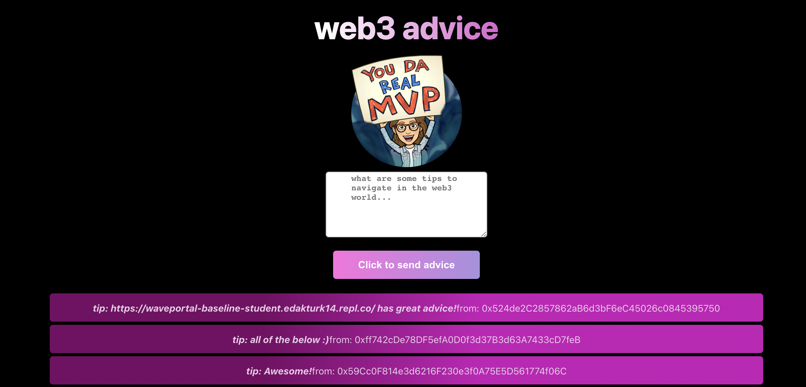

# _buildspace Advice Portal 

UI for _buildspace modified wave project. 
The contract for the webui can be found here: 

### Tools:
- React: build the ui 
- Hardhat: deploy the contract on the Rinkeby Test network. 
- Alchemy: ethereum api to make request to the test network. 
- Metamask: crypto wallet to make transactions on the blockchain

### Demo:

### Webapp:
Send me your advice! https://waveportal-baseline-student.edakturk14.repl.co/ 
